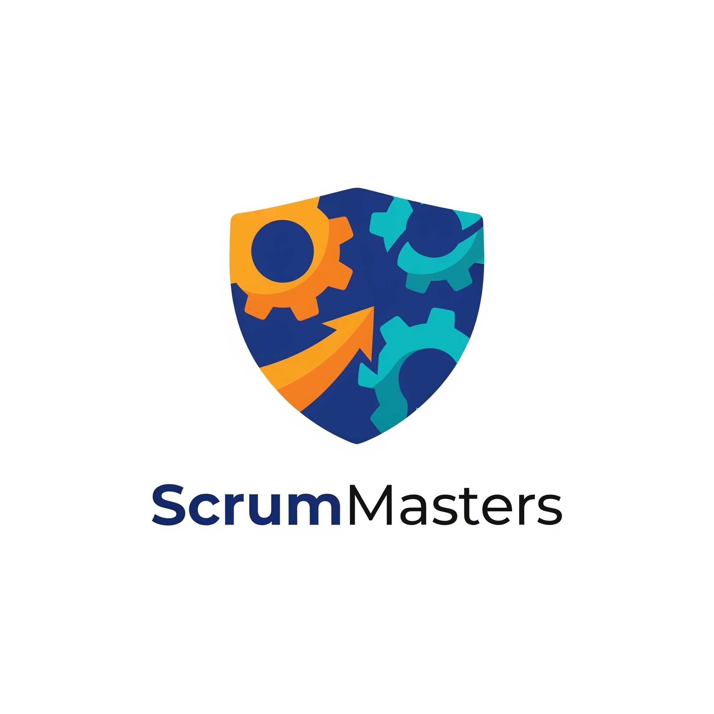

# ScrumMasters

Inicialmente, estruture o documento README para conter as seguintes informações:  

 

AS63C - Desenvolvimento Ágil - N13 (2025_02) 

<table>
    <thead>
        <tr style="background-color: purple; color: white" >
            <th style="border-style:solid;border-width:1px;text-align:center">Nome</th>
            <th style="border-style:solid;border-width:1px;text-align:center">RA</th>
            <th style="border-style:solid;border-width:1px;text-align:center">Link Github</th>
        </tr>
    </thead>
    <tbody>
        <tr>
            
            <td style="border-style:solid;border-width:1px;text-align:center;vertical-align:middle" rowspan="1">Luiz Gustavo Garbelini Ramos</td>
            <td style="border-style:solid;border-width:1px;text-align:center;vertical-align:middle" rowspan="1">2504081</td>
            <td style="border-style:solid;border-width:1px;text-align:center;vertical-align:middle" rowspan="1"> https://github.com/LuizGustavo2105 </td>
        </tr>
        <tr>
            
            <td style="border-style:solid;border-width:1px;text-align:center;vertical-align:middle" rowspan="1">Lucas Emanuel Adao Rocha</td>
            <td style="border-style:solid;border-width:1px;text-align:center;vertical-align:middle" rowspan="1">2531836</td>
            <td style="border-style:solid;border-width:1px;text-align:center;vertical-align:middle" rowspan="1"> - </td>
        </tr>
        <tr>
            
            <td style="border-style:solid;border-width:1px;text-align:center;vertical-align:middle" rowspan="1">Luca Garcia Santos</td>
            <td style="border-style:solid;border-width:1px;text-align:center;vertical-align:middle" rowspan="1">2612429</td>
            <td style="border-style:solid;border-width:1px;text-align:center;vertical-align:middle" rowspan="1">https://github.com/lucagarciasantosutfpr</td>
        </tr>
        <tr>
            
            <td style="border-style:solid;border-width:1px;text-align:center;vertical-align:middle" rowspan="1">Gabriel Takao Ito da Rocha</td>
            <td style="border-style:solid;border-width:1px;text-align:center;vertical-align:middle" rowspan="1">2706377</td>
            <td style="border-style:solid;border-width:1px;text-align:center;vertical-align:middle" rowspan="1">https://github.com/Gabrie1Tk</td>
        </tr>
        <tr>
            
            <td style="border-style:solid;border-width:1px;text-align:center;vertical-align:middle" rowspan="1">Matheus Pelicaro Lopes</td>
            <td style="border-style:solid;border-width:1px;text-align:center;vertical-align:middle" rowspan="1">2476436</td>
            <td style="border-style:solid;border-width:1px;text-align:center;vertical-align:middle" rowspan="1">https://github.com/matheuspelicarolopes</td>
        </tr>
</table>

Aplicativo de Quiz Educacional

Descrição: Jogo de perguntas e respostas com placar.

Funcionalidades possíveis:

Usuário responde quiz de múltipla escolha.

Feedback imediato (acertou/errou).

Ranking entre jogadores.(objetivo, principais funcionalidades, público-alvo, etc) 

e.	Documentos que serão encontrados no repositório (criaremos links para cada documento como se fosse um sumário). Por enquanto, deixem sem link:  
